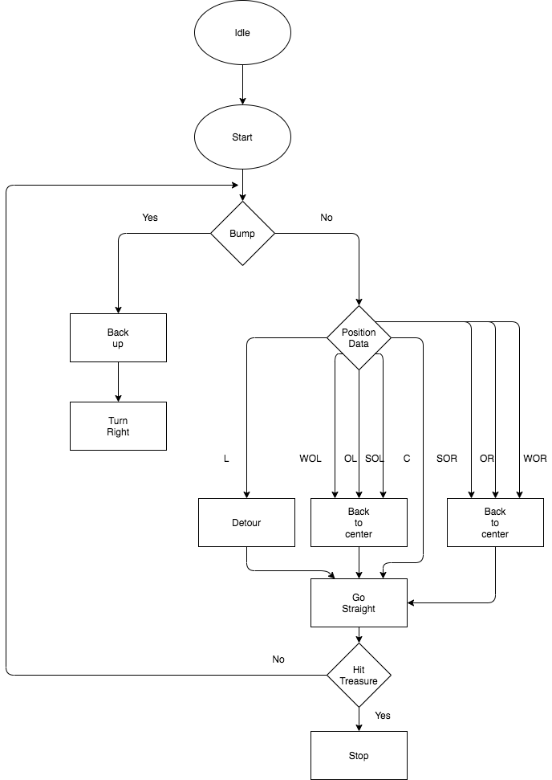
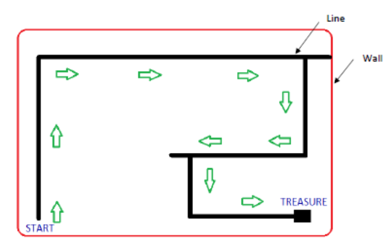
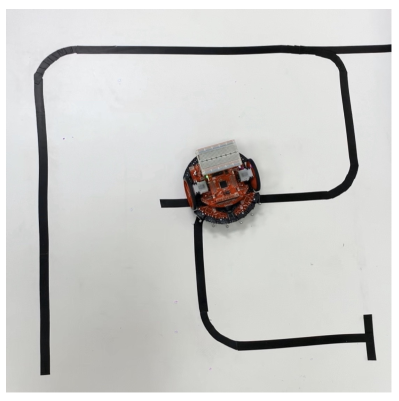
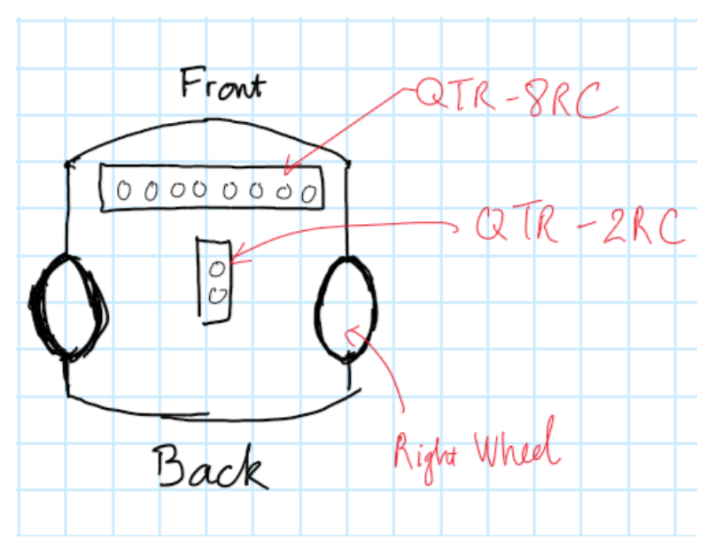

<h1> LineFollowRobot</h1>

<ol>
<h2 align="justify"><a href="https://youtu.be/LGU57HhluS0"> Demo</a></h2>
<h2> Abstract:</h2>
 Making a robot follows a given black line on a white given platform and searches the path to the treasure.

<li><b>Objective</b></li>

The final project required to design a Line Follower Maze Robot using TI Robotics System Learning Kit by leveraging the skills learned in different phases of the lab throughout the semester. The goal of the project was to integrate the line sensor and the bump sensor to solve a maze that searches for a treasure.  The project was a combinational lab with six modules: Module 6 for GPIO interface the line sensor, Module 10 for SysTick interrupts, Module 12 and 13 for bump sensor, motors and PWM control, and Module 13 for line follower building. To achieve the goal of the project, the robot should start from the start point on the platform, self-drive via the line, know how to find the right path to the treasure and how to back up for lost, and stop at the treasure spot.  

<li><b>Required Components</b></li>
<ul>
<li>Robot chassis, DC motors, and wheels.</li>
<li>Motor drive and power distribution board.</li>
<li>Line IR sensors</li>
<li>Bump sensors</li>
<li>MSP432P401R MCU LaunchPad</li>
<li>Rechargeable battery, pack of 6, metal hydride, 1300mAh, 1.2V, AA</li>
</ul>
<li><b>Design Methodology</b></li>

The first part of the lab was to test the reflectance of the sensor in module 6. At this step, there are nine cases need to be recorded: 

<ul>
<li>The robot stayed at the center: Position >-47 && Position <47.</li>
<li>Slightly off to the left: Position <= -47 && Position > -142</li>
<li>Slightly off to the right: Position >= 47 && Position <142</li>
<li>Off to the left: Position <= -142 && Position >-237</li>
<li>Off to the right: Position >= 142 && Position < 237</li>
<li>Way off to the left: Position <= -237 && Position > -332</li>
<li>Way off to the right: Position >= 237 && Position < 332</li>
<li>Lost: Data == 0b11111111 && Position == 0</li>
<li>At the treasure’s position: Data == 0b00000000 && Position == 333</li>
</ul>

Theoretically, when the robot stayed at the center position, it should go forward until the next instruction came. When the robot was not at the center, it should fix its path back to the center. 

The second part of the lab was to test the bump interruption. Theoretically, when any of the bumps were activated, meaning there was a wall exist, the robot should back up and search for a new path.

The third part of the lab was to set the same PWM on both motors when the robot ran, but the time delay is different for each of the 9  cases that should be different. This design was to easily control the robot.

Combine 3 parts above, we have flow chart as Figure 1.

Figure 1: Flow chart of design.

<li><b>Testing Result</b></li>

The demonstration is performed on the platform as figure 2.

Figure 2: Robot explorer path to the treasure.

 The successfully rate after 20 tests is 95%. During the failed test, the robot was encountered a situation where the sensors array was perpendicular to the track (Figure 3), so the robot thought that it hit the treasure so it stopped. This is a room for improvement.

Figure 3: The sensors array is perpendicular to the track.

<li><b>Conclusion & Improvement</b></li>

The robot can run on the given platform with 95% successful rate. All the challenges have been solved.

The project provided a chance to practice:

<ul>
<li>Periodic SysTick interrupts to measure the line sensor.</li>
<li>Periodic Timer A1 interrupts to run the high-level strategy.</li>
<li>Edge triggered interrupts for collisions.</li>
<li>Main program for debugging and low priority tasks.</li>

</ul>

Beside that, the robot all so need two improvements:

<ul>
<li align="justify">Try to reach 99.99% successful rate. Figure has shown the failed case. We should add another array of sensor (Figure 5), so the robot can distinguish the failed case and the treasure. Failed case: QTR-8RC is seeing the black line while QTR-2RC is seeing the white space, then the robot keep running forward. Treasure case, both QTR-8RC and QTR-2RC are seeing black line, the robot stops. By doing this, we can eliminate the encountered failed case.</li>

Figure 5: Robot after adding QTR-2RC sensor.

<li align="justify">Currently, the average time to reach the treasure is 60 seconds. Therefore, another key improvement will be speed up the robot by modifying the algorithm and delay time, so it can finish the task faster than the present version.</li>
</ul>
</ol>
